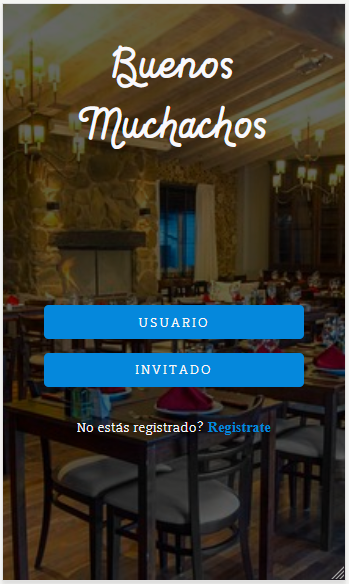
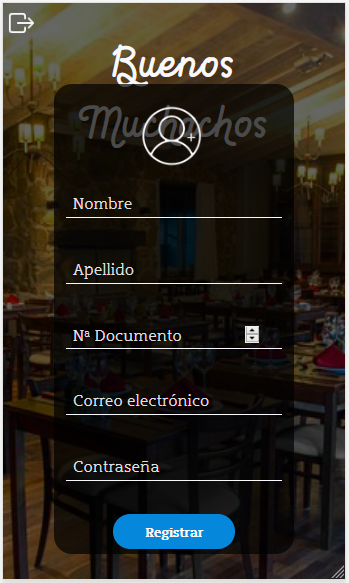
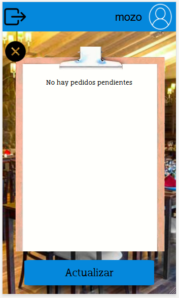
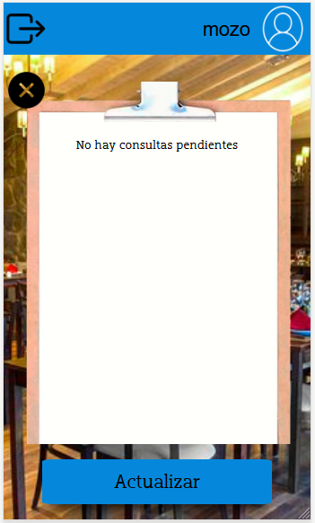
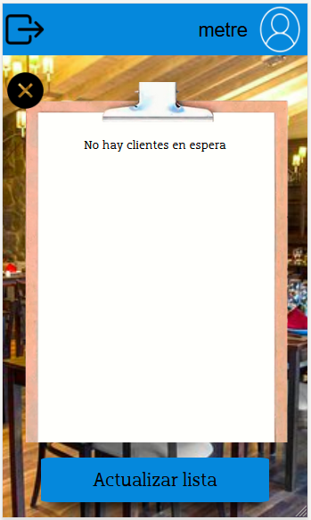
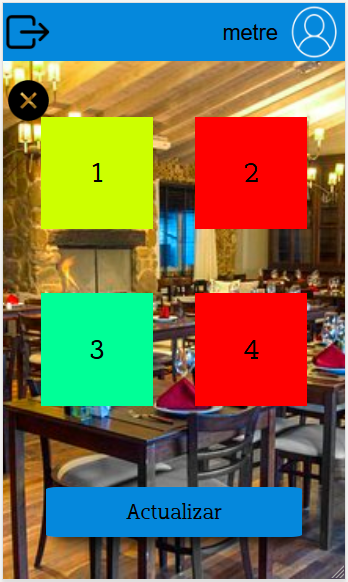
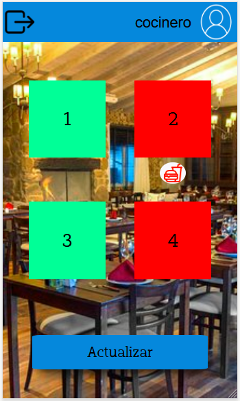
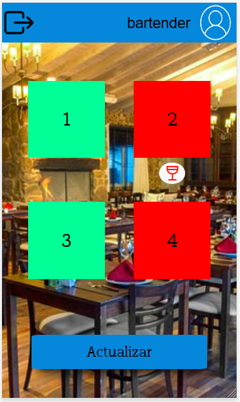

# Buenos Muchachos

#Integrantes
##Adrian Brizuela
##Denis Leonel Pedmeonte

Buenos Muchachos es una aplicacion de gestion de un restaurant. Basicamente presenta herramientas para administrar operaciones tanto internas como de cara al cliente.

## Tecnologia

Stack de tecnologias: El stack utilizado consiste en Angular (Incluyendo Angular Material), Typescript, y Firebase (Database, Storage).

## Caso de Uso

El caso de uso se basa en un restaurant que requiere desarrollar una herramienta de gestion tanto para el personal de piso, gerencia y cocina como para los clientes.

## Perfiles

### Dueño/Supervisor

### Cliente

El Cliente es una de los usuarios finales que maneja la plataforma.

### Metre

El metre posee vision de mesas disponibles para su facil distribucion

### Mozo

El mozo es una de los perfiles, junto con el de cliente, que mas visibles son en la operatoria. Ya que interactuan entre si, junto con la comida y bebida para el flujo comercial.

### Bartender

El bartender dispone de vistas para la preparacion de las bebidas solicitadas.

### Cocinero

El cocinero dispone de vistas para la preparacion de las comidas solicitadas.

## ¿Como lo Uso?

### Login

Inicialmente, el usuario final se encontrara en una pantalla de login, desde aqui podra registrarse o bien iniciar sesion con sus credenciales.

### Registro

En principio se debe indicar que perfil se desea generar, luego podra generar usuario escaneando su DNI o un ingreso manual.:

### Por otro lado, el Dueño tambien tiene la posibilidad de generar usuarios. Tambien con ingreso manual o por escaneo de DNI.

## Clientes

El inicio de la experiencia se da con una simple pantalla adonde escanear un codigo:

Ademas cuenta con un menu...

Posibilidades de consultar al mozo.

Sistema de propinas basado en satisfaccion del cliente.

El cliente ademas posee la capacidad de revisar su estado:

##Mozo: El mozo tiene varias funciones fundamentales para la gestion de su espacio de trabajo.

## Metre

## Cocinero
El cocinero posee una pantalla integra de atencion y vision de pedidos.

## Bartender
El bartender posee una pantalla integra de atencion y vision de pedidos.

# Hoja de Ruta:

Semana del 18 de Octubre al 24 de Octubre:
Se realizaron las primeras definiciones del modelo.
Adrian Brizuela: Clases y estructura iniciales para lograr comenzar a alinearnos a las consignas
Denis Leonel Pedemonte: Primeras pruebas en firebase, definicion de la estructura de datos a nivel inicial.

Semana del 25 de Octubre al 31 de octubre:
Adrian Brizuela: Definicion de pantallas de login, flujo de registro.
Denis Leonel Pedemonte: Testeo e investigacion sobre realtime database.

Semana del 1ro de Noviembre al 7 de Noviembre:
Adrian Brizuela: Login completo, implementacion de spinners y algunos diseños animados.
Denis Leonel Pedemonte: Inicio del desarrollo de la ventana de cliente, mozo, y dueño. Guards.

Semana del 8 de Noviembre al 14 de Noviembre:
Adrian Brizuela: Implementacion de libreria de scanner, inicio de las funciones del scanner para el dni, persistencia de registros en base.
Denis Leonel Pedemonte: Bug Fixes, Operatoria del Metre, mejoras en los servicios conectados a firebase (metodos puntuales para tareas simples, como si fueran microservicios)
Implementacion de Iconos, implementacion de los codigos QR en el repositorio con los nuevos codigos de mesa. Fotos del README.md,
Confeccion del README.md.

Semana del 15 al 22 de Noviembre (Pre Entrega con Nota):

Adrian Brizuela Notificaciones Push, Testeo en dispositivos, Implementacion de pipes, cambios de estilo.
Denis Leonel Pedemonte Notificaciones Push, cambios en el README, credenciales Gmail, bugfixes, testeo en dispositivos, Pantalla de estado de pedido, Implementacion de Pipes, bug fixes, tareas de optimizacion de flujo de carga de pedido, Mejoras en flujo de usuario anonimo (invitado). Pruebas de flujo completo.

